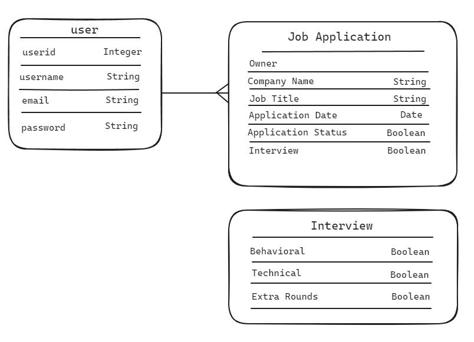

## Job Job
It's a job tracker. Save and keep track jobs you've applied to and update the status as things progress or don't. 

### As a user I want to
- sign up/in/out
- save jobs
- view all my jobs by status
- update the status of the application (looking at/ applied/ interviews/ rejected/ offers)
- add/update notes for the job
- delete jobs

### Bonus
- Have auto email updates to remind me when applications are closing
- email updates reminding of interviews

### ERDs
